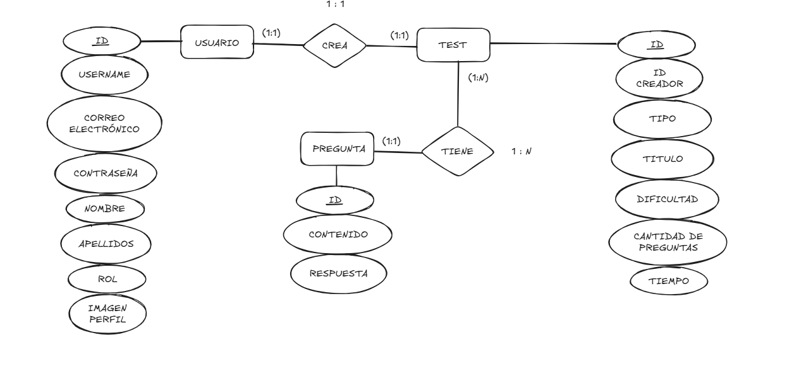

# API-REST TESTS EZ-LEARNING

## IDEA DE LA API
    Esta es una API en la que los usuarios podrán obtener los datos de unos tests, y cada uno de ellos está compuesto 
    por un número de preguntas. 
    Los usuarios se diferenciarán en dos tipos o roles, los usuarios "normales" que serán los alumnos
    los cuales podrán acceder a los tests pero no tendrán privilegios para acceder a métodos POST. El otro tipo
    de rol que existirá es el "Profesor" que será como un administrador el cual podrá acceder a todos los datos y 
    hacer uso de los métodos POST de la aplicación.

## LÓGICA DE NEGOCIO
    Los usuarios tendrán dos roles, "ALUMNO" o "PROFESOR":

    - Los usuarios alumnos podrán acceder a los tests cuya dificultad sea igual o mayor que la dificultad del test. Además podrán acceder a sus propios datos de usuario.

    -Los usuarios profesores tendrán la capacidad de crear tests, que a su vez crearán las preguntas introducidas en la base de datos.Estos usuarios podrán acceder a los datos de todos los usuarios y serán los que se encarguen de la gestión de datos tanto de tests como de usuarios.

## TABLAS Y PROPIEDADES
    - PREGUNTA
        id: Long
        contenido_pregunta: String
        respuesta: String

    - TESTS 
        id: Long
        id_usuario_creador: Long
        tipo: String
        titulo: String
        dificultad: String
        cantidad_preguntas: Int
        tiempo: Int
        preguntas: List< Pregunta >
    
    - USUARIOS
        id: Long
        username: String
        correo_electronico: String
        password: String
        nombre: String
        apellidos: String
        nivel: String
        rol: String
        imagen_perfil: String

## RELACIONES ENTRE LAS TABLAS
    - Los tests tendrán una relación 1:N con las preguntas, puesto que un test está compuesto por varias preguntas.
    - Los usuarios tendrán una relación 1:1 con los tests, ya que un test es creado por un usuario.

## DIAGRAMA ENTIDAD RELACIÓN

## JUSTIFICACIÓN DEL PROYECTO
Esta API está destinada a una aplicación web llamada Ez Learning. Ez Leaning es una aplicación cuyo objetivo que será dirigida a un público en concreto: los profesores de clases particulares.
Será una aplicación web cuya finalidad consistirá en mejorar el nivel de inglés de los usuarios de forma fácil y entretenida. Estará pensada para ayudar a los usuarios practicando mediante ejercicios y tests las tres skills básicas del inglés (Grammar, Listening, Vocabulary). Conforme se vayan superando los tests, el usuario podrá optar a tomar un examen el cual le permitirá subir el nivel de los tests de la aplicación. 
Creo que esta aplicación es necesaria puesto que actualmente, aunque hay muchas herramientas para aprender inglés, no hay ninguna para este caso específico. Además, es un público que aunque sea nicho, actualmente el número de academias y clases particulares está aumentando por lo que serviría para aumentar la cantidad de usuarios que usaran la aplicación. Hablando desde mi propia experiencia, creo que es una herramienta que podría ser muy útil para hacer que estas clases sean más dinámicas.

## ENDPOINTS
##### Usuarios:
* POST /login:
  Servirá para que los usuarios puedan identificarse antes de poder usar la aplicación.
  - **Entrada**: JSON con `username` y `password`.
  - **Salida**: Token de la sesión si las credenciales son válidas.

* POST /usuarios/:
  Se usará a modo de registro, cualquier persona identificada o no podrá acceder a este endpoint.
  - **Entrada**: JSON con todos los datos de un usuario.
  - **Salida**: JSON con los datos del usuario registrado.

* GET /usuarios/{username}:
  Se devolverán los datos de un usuario, si el usuario es un usuario no profesor, se comprobará que el nombre introducido es el del usuario que hace la llamada puesto que un alumno no puede acceder a los datos de otros alumnos.
  - **Salida**: JSON con los datos del usuario.

* DELETE /usuarios/{id}:
  Se eliminará de la base de datos los datos del usuario cuyo id coincida con el que se pasa por parámetros, solo los profesores podrán acceder a este endpoint.
  - **Entrada**: El ID del usuario que se quiere eliminar.
  - **Salida**: JSON con los datos del usuario eliminado.

* PUT /usuarios/{id}:
    Un usuario profesor será capaza de modificar los datos de los demás usuarios. Solo podrá modificar datos no esenciales, entre los cuales no se incluyen la contraseña o el id.
  - **Entrada**: Un JSON con los datos que se quieren cambiar.
  - **Salida**: JSON con los nuevos datos del usuario.

##### Tests:
* POST /tests/:
  Los usuarios profesores podrán crear tests.
  - **Entrada**: Un JSON con los datos del nuevo test.
  - **Salida**: JSON con los datos del test creado.

* GET /tests/:
Los usuarios validados podrán acceder a todos los tests, los profesores podrán ver todos mientras que los alumnos solo verán los de su nivel.
  - **Salida**: Una lista de tests que depende del rol del usuario.

* GET /tests/{id}:
Los usuarios validados podrán acceder a los datos de un test específico usando el id para ello
  - **Entrada**: La ID del test al que se quiere acceder.
  - **Salida**: Una lista de tests que depende del rol del usuario.

* PUT /tests/{id}:
Los usuarios profesores podrán modificar los datos de los tests que ellos requieran, solo podrán acceder a este edpoint los usuarios cuyo rol sea profesor.
  - **Entrada**: La ID del test y un JSON con los datos a modificar.
  - **Salida**: Un JSON con los nuevos datos del test.

* DELETE /tests/{id}:
  Permite eliminar un test, solo pueden acceder los usuarios profesores.
  - **Entrada**: La ID del test a eliminar.
  - **Salida**: Un JSON con los datos eliminados.

##### Preguntas:
* A ESTOS ENDPOINTS SOLO PODRÁN ACCEDER USUARIOS PROFESORES Y CON UN TOKEN VÁLIDO.
* POST /preguntas/:
Permite crear una nueva pregunta y añadirla a la base de datos.
  - **Entrada**: Un JSON con los datos de la nueva pregunta.
  - **Salida**: Un JSON con la pregunta añadida a la base de datos.

* GET /preguntas/:
Busca los datos de todas las preguntas en base de datos.
  - **Salida**: Un JSON con los datos de todas las preguntas.

* GET /preguntas/{id}:
Busca los datos de una pregunta.
  - **Entrada**: La ID de la pregunta.
  - **Salida**: Un JSON con los datos de la pregunta.

* PUT /preguntas/{id}:
Permite modificar los datos de una pregunta.
  - **Entrada**: La ID de la pregunta y un JSON con los datos a modificar.
  - **Salida**: Un JSON con los nuevos datos de la pregunta.

* DELETE /preguntas/{id}:
Permite elminar una pregunta.
  - **Entrada**: La ID que se quiere eliminar.
  - **Salida**: Un JSON con la pregunta que se ha eliminado.

## LÓGICA DE NEGOCIO
- La contraseña y el correo electrónico deben seguir un patrón regex.
- Menos para registrarse, ningún usuario podrá acceder a los endpoints si su token de validación está caducado o no es válido.
- Un usuario profesor puede acceder a todos los endpoints, pero no podrá modificar los datos de otros profesores.
- Los alumnos pueden leer todos los tests, pero solo si la dificultad es de su nivel o menor.
- Un alumno puede acceder a sus propios datos, pero no a los de otros usuarios.
- Las preguntas se pueden añadir manualmente, pero lo estándar es que se creen al añadirlas en una lista al crear el test.
- Una pregunta no se creará en base de datos si hay alguna igual ya creada.
- Los tests no podrán tener como tiempo más de 30 minutos, tampoco podrán tener mas de 20 preguntas.

## CÓDIGOS DE ESTADO
#### Códigos de estado genéricos
Estos códigos de estados se usan en todos los endpoints:
- OK (200): Para cuando una petición GET o PUT ha sido realizada con éxito.
- CREATED (201): Para cuando una petición POST se realiza satisfactoriamente.
- NO CONTENT (204): Para cuando una petición DELETE es realizada con éxito.
- NOT FOUND (404): Cuando una petición GET no puede ser realizada ya que no se ha encontrado el recurso requerido.
- UNAUTHORIZED (401):Se usará si el usuario intenta acceder a un método para el cual no tiene permisos.
- INTERNAL SERVER ERROR (500): Si el servidor falla por alguna razón diferente a las anteriores

#### Códigos de estado específicos:
- CONFLICT (409): Este código saldrá si a la hora de crear una pregunta ya está repetida en base de datos.
- BAD REQUEST (400): Si a la hora de registrarse o modificar un dato no se cumple con las restricciones regex de ciertos campos, saldrá este error.
  

    
